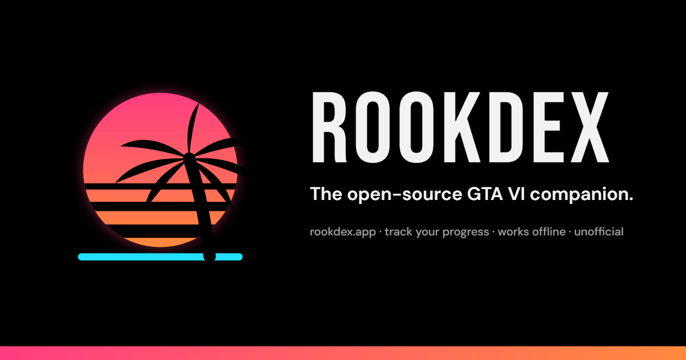
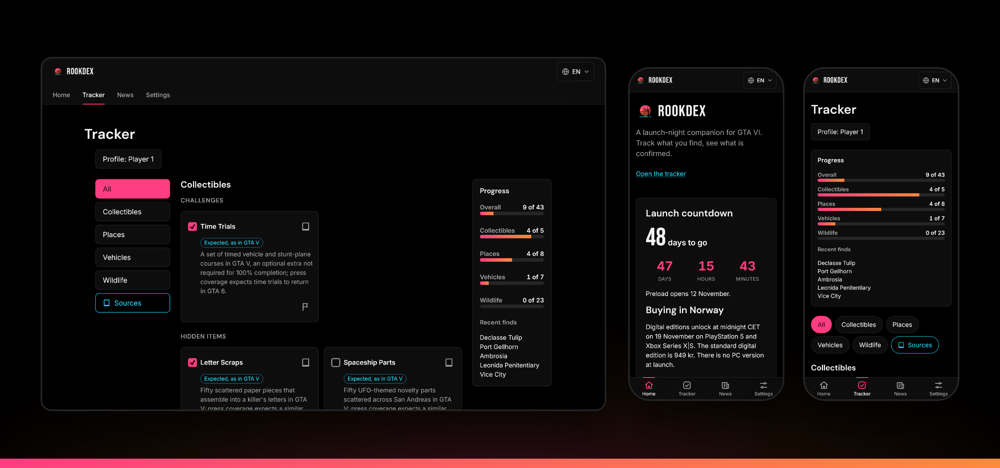
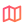
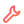
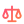

# Rookdex

Leonida is waiting, and you'll want somewhere to keep score. Rookdex gives you a countdown, a tracker and a straight answer on what's actually confirmed.

**[Open rookdex.app](https://rookdex.app)** · English and Norsk · free · no account

<a href="https://rookdex.app"></a>

##  What you get

- **A countdown** to 19 November 2026, ticking down to the minute.
- **A tracker** for wildlife, vehicles, places and collectibles. Spot a gator, tick a box, watch the bar fill up.
- **Confirmed, expected or rumour.** Every tracker item shows its tier and its sources. Rumours live on the News page with a label on them, so you can tell a trailer frame from somebody's cousin's friend.
- **Before you start**, a short guide to editions and what to sort out before launch night.

##  Your save file stays with you

Your progress lives in your browser, not on a server. No account, no password, no "please verify your email". Install it to your home screen and it keeps working offline, even in a basement with zero bars. Switching phones? Export your profile and take it with you.

##  The small print

Rookdex is an unofficial fan project. It is not affiliated with or endorsed by Rockstar Games or Take-Two Interactive. Confirmed means Rockstar has shown or said it. Expected means it was in earlier games and press coverage expects it back. Anything else is a rumour, and it's labelled as one.


##  Under the hood

Astro 7 with React islands · TypeScript · Biome · Vitest · Cloudflare Workers (static assets)

```bash
npm install
npm run dev
```

`npm run build` writes the site to `dist/`, and `npm run preview` serves that folder the way Cloudflare does. `npm test` runs the unit tests and `npm run check` type-checks. Pull requests get a preview URL in the CI job summary. Merging to `main` deploys to https://rookdex.app through Cloudflare Workers static assets. Design specs and plans live in `docs/superpowers/`.

<details>
<summary>Brand files, README art and how to rebuild them</summary>

Colours and type are tokens in `src/styles/tokens.css`. Components read tokens and never write a colour of their own. The mark is `public/icon.svg` (the app icon) and `src/components/Mark.astro` (in-page, token-coloured). The social banner is rendered from `docs/brand/og.html` to `public/og.png`. The brand spec is `docs/superpowers/specs/2026-09-21-rookdex-brand-design.md`.

To rebuild the icons, run `npm run icons` for the PWA set and `npm run icons:favicon` for the favicon, which is generated separately from `assets/favicon-source.svg`. It is the same mark without the palm, which is noise at 16 px. To rebuild the banner, run `node docs/brand/serve.mjs`, open `http://localhost:4400/docs/brand/og.html` and call `render()` in the browser console. It posts the canvas back to the server, which writes `public/og.png`.

The README art lives in `docs/readme/`. To refresh the screenshot after a UI change, run `node docs/readme/capture.mjs`. It screenshots https://rookdex.app on a phone and a desktop viewport with headless Brave, places the shots into `docs/readme/screens.html` and writes `docs/readme/screens.png`. Set `BROWSER_PATH` to use another Chromium browser, or pass a base URL to capture a local preview.

</details>

##  Licence

Code is MIT (see `LICENSE`; the brand files listed there are excluded). Guide text under `src/content/` is CC BY-SA 4.0.

The Rookdex name, mark and banner are not under the MIT licence. Use them to link to or talk about Rookdex, not to present another project as Rookdex.

The GitHub mark in the footer comes from Octicons (MIT, © GitHub Inc.) and is used under GitHub's logo guidelines to link to this repository.
